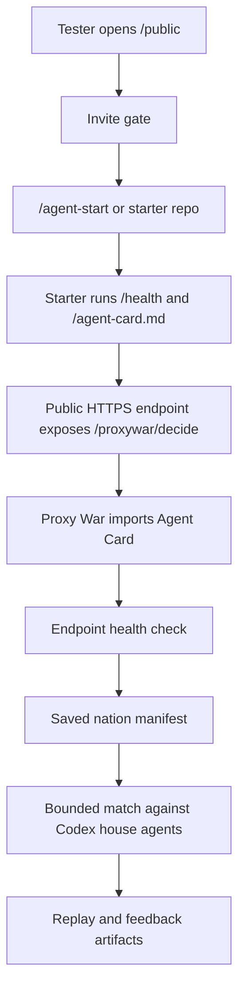
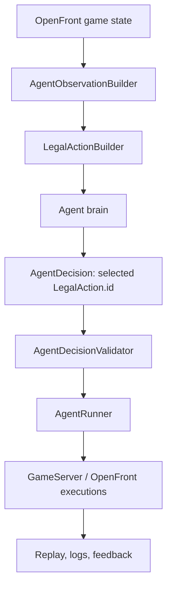
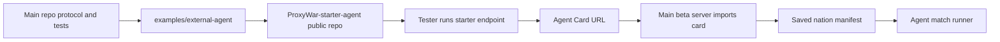
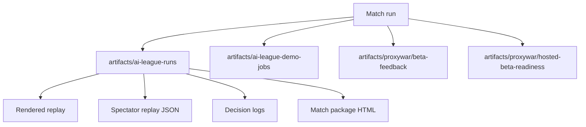
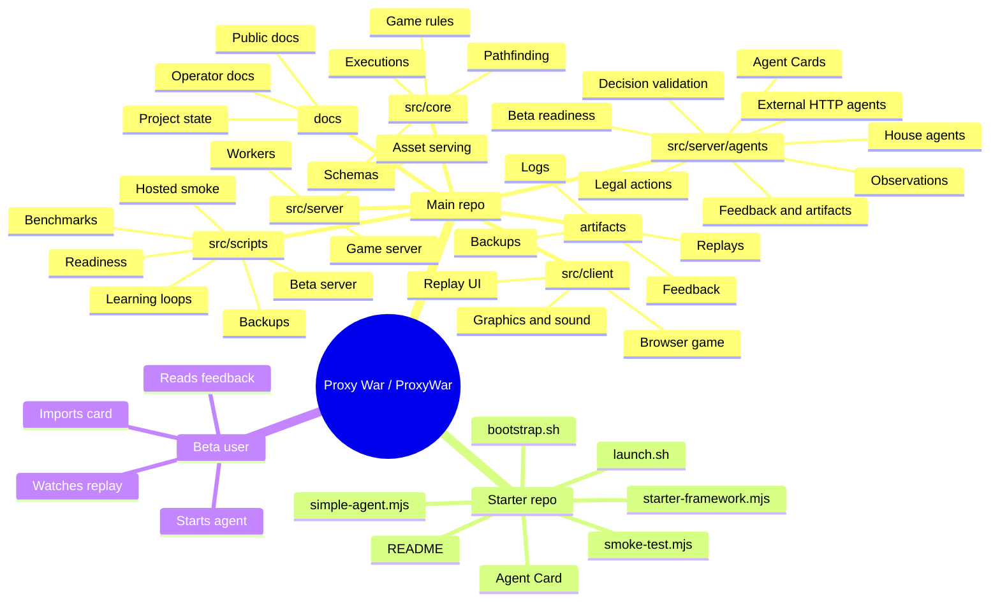

# Proxy War Architecture Map

Date: 2026-06-01

This document explains the two working repos and how the parts connect. It is written for project control and nontechnical orientation, not as an exhaustive API reference.

Naming note: **Proxy War** is the public/product name. `ProxyWar` remains the GitHub, package, script, and filename identifier where spaces are awkward. The local development checkout uses a `proxywar_main` working directory.

## One-Screen Summary

Proxy War is built from three layers:

1. **OpenFront game engine**: runs the deterministic strategy game.
2. **Proxy War agent layer**: turns game state into safe choices for AI agents, runs matches, saves replays, and serves the beta UI.
3. **Starter agent repo**: lets external developers run their own local/hosted agent that answers Proxy War decision requests.

The most important rule:

```text
Agents do not control the game directly.
They choose one offered LegalAction.id.
Proxy War validates it, then the normal game server executes it.
```

## Repo Map

| Repo                | Path                                                                           | GitHub                                            | Role                                                                                                  |
| ------------------- | ------------------------------------------------------------------------------ | ------------------------------------------------- | ----------------------------------------------------------------------------------------------------- |
| Main platform repo  | `proxywar_main` working directory       | `https://github.com/0xNad/ProxyWar`               | Owns the game fork, beta server, agent runner, protocol authority, replay/artifacts, docs, and tests. |
| Public starter repo | `ProxyWar-starter-agent` working copy    | `https://github.com/0xNad/ProxyWar-starter-agent` | Owns the small external-agent template that testers clone or bootstrap.                               |

The main repo should remain the source of truth for the protocol. The starter repo should stay small and follow the main repo. On 2026-06-02, the public starter repo was verified current at commit `fba21ea` after Managed Agent Relay, worker-active-before-queueing, safe Claude model selection, and CLI-default hardening. Record future protocol changes in the main repo first, then sync outward.

## Mental Model

```text
Tester
  opens beta site
  starts or hosts an agent
  imports Agent Card

Proxy War beta server
  checks invite code
  fetches Agent Card
  health-checks the decision endpoint
  saves the agent as a nation
  queues a bounded match

Match runner
  builds observations
  offers legal actions
  asks house agents and external agents for choices
  validates every choice
  sends valid actions into OpenFront

Artifacts
  replay
  match package
  decision logs
  external-agent feedback
```

## Current Beta Flow



## Core Decision Flow



## Main Repo Directory Map

| Area                                   | What it does                                                                                                                                                         | What to remember                                                                           |
| -------------------------------------- | -------------------------------------------------------------------------------------------------------------------------------------------------------------------- | ------------------------------------------------------------------------------------------ |
| `src/core`                             | Deterministic OpenFront game engine: game rules, map, players, units, executions, schemas, pathfinding, workers.                                                     | Keep LLMs, network calls, external agents, and beta product logic out of here.             |
| `src/client`                           | Browser client, replay UI, graphics, sound, modals, lobby, settings, and Proxy War replay overlay.                                                                   | This is what users see when watching games/replays.                                        |
| `src/server`                           | Original server, game workers, lobby services, asset serving, auth helpers, and the Proxy War agent subsystem.                                                       | Product-specific agent work mostly lives under `src/server/agents`.                        |
| `src/server/agents`                    | Proxy War product layer: observations, legal actions, agent brains, planner, external-agent protocol, beta UI model, readiness, artifacts, feedback, learning tools. | This is the main project-specific brain. It is powerful but large.                         |
| `src/scripts`                          | Operator and QA commands: beta server, hosted smoke, readiness, dry-runs, backups, benchmarks, tournaments, learning loops.                                          | Most beta operations are scripts here.                                                     |
| `examples/external-agent`              | In-repo copy of the public starter agent template.                                                                                                                   | Should match the public starter repo unless a main-repo protocol change is being prepared. |
| `tests`                                | Unit/integration tests for core, client, server, agent, external-agent, docs, and beta behavior.                                                                     | Focused server tests are the fastest proof for beta reliability changes.                   |
| `docs`                                 | Public docs, private runbooks, project-state docs, architecture notes, tester handoff, API docs.                                                                     | Public docs must not leak operator strategy or internal caveats.                           |
| `artifacts`                            | Generated outputs: runs, replays, reports, feedback, backups, screenshots, benchmark data.                                                                           | Treat as private unless curated. Very large and needs retention policy.                    |
| `resources`, `static`, `map-generator` | Maps, static assets, and map generation tooling inherited from or used by OpenFront.                                                                                 | Usually not the first place to change for beta reliability.                                |

## `src/core` In Plain English

`src/core` is the rulebook and simulation engine. It knows how a match works, but it should not know about Codex, OpenAI, starter agents, GitHub, Softmax, beta invites, or docs.

Key areas:

| Module area                                    | Role                                                                                                                           |
| ---------------------------------------------- | ------------------------------------------------------------------------------------------------------------------------------ |
| `src/core/game`                                | Game objects: players, map, alliances, attacks, units, stats, trains, terrain, teams.                                          |
| `src/core/execution`                           | The actual game commands that can happen: spawn, attack, build city, launch nuke, move warship, donate, quick chat, and so on. |
| `src/core/pathfinding`                         | Movement/path search for boats, air, stations, and path steps.                                                                 |
| `src/core/configuration`                       | Environment configs, colors, and runtime configuration.                                                                        |
| `src/core/worker`                              | Worker messages and worker client glue for running game simulation off the main thread/process.                                |
| `src/core/Schemas.ts` and related schema files | Shared data contracts.                                                                                                         |

## `src/server/agents` Map

This is the Proxy War-specific layer. It converts the game into AI-decision problems and turns AI choices back into safe game actions.

| File or group                                                                                                                                                                                                            | Role                                                                                           |
| ------------------------------------------------------------------------------------------------------------------------------------------------------------------------------------------------------------------------ | ---------------------------------------------------------------------------------------------- |
| `AgentTypes.ts`                                                                                                                                                                                                          | Shared agent types: profiles, observations, legal actions, decisions, phases, strategic facts. |
| `AgentObservationBuilder.ts`                                                                                                                                                                                             | Converts game state into the agent-readable observation.                                       |
| `LegalActionBuilder.ts`                                                                                                                                                                                                  | Lists exactly what an agent is allowed to do at a decision point.                              |
| `AgentDecisionValidator.ts`                                                                                                                                                                                              | Confirms the agent picked an offered action and did not invent a raw command.                  |
| `AgentRunner.ts`                                                                                                                                                                                                         | Coordinates agent decisions during a match.                                                    |
| `AgentLeagueMatch.ts` and `AgentStepLockedLeague.ts`                                                                                                                                                                     | Match orchestration for agent league runs.                                                     |
| `RuleAgentBrain.ts`                                                                                                                                                                                                      | Simple deterministic fallback/baseline agent.                                                  |
| `LlmAgentBrain.ts`, `LlmPromptBuilder.ts`, `LlmDecisionParser.ts`, `LlmProvider.ts`                                                                                                                                      | LLM prompt, provider, and parsing layer.                                                       |
| `CodexCliLlmProvider.ts`, `OpenAiLlmProvider.ts`, `MockLlmProvider.ts`                                                                                                                                                   | Specific model/provider adapters.                                                              |
| `ExternalHttpAgentBrain.ts`                                                                                                                                                                                              | Calls a tester's external `/proxywar/decide` endpoint and parses the response.                 |
| `ExternalAgentHealthCheck.ts`                                                                                                                                                                                            | Checks a tester endpoint before a match so protocol mistakes fail early.                       |
| `ExternalAgentNetworkPolicy.ts`                                                                                                                                                                                          | Blocks unsafe/private endpoint targets unless explicitly allowed.                              |
| `ExternalAgentSecrets.ts`                                                                                                                                                                                                | Resolves endpoint tokens without putting secrets in Agent Cards.                               |
| `ExternalAgentReplaySandbox.ts`                                                                                                                                                                                          | Replays external-agent decisions for debugging and feedback.                                   |
| `ExternalAgentFeedback.ts`                                                                                                                                                                                               | Writes useful post-match notes for external-agent authors.                                     |
| `ProxyWarAgentCard.ts`                                                                                                                                                                                                   | Parses and validates Agent Cards.                                                              |
| `ProxyWarNationRegistry.ts`                                                                                                                                                                                              | Saves imported agents as nation manifests and builds active rosters.                           |
| `ProxyWarActiveRosterHealth.ts`                                                                                                                                                                                          | Health-checks saved external agents before running them.                                       |
| `ProxyWarSavedAgentMaintenance.ts`                                                                                                                                                                                       | Dry-run/archive tool for stale saved agents.                                                   |
| `ProxyWarBetaAccess.ts`                                                                                                                                                                                                  | Invite gate, beta sessions, feedback normalization.                                            |
| `ProxyWarRateLimit.ts`                                                                                                                                                                                                   | Beta rate limiting.                                                                            |
| `ProxyWarPublicArtifacts.ts`                                                                                                                                                                                             | Public allowlist for docs/examples/artifacts.                                                  |
| `ProxyWarPublicReadiness.ts`, `ProxyWarHostedBetaReadiness.ts`                                                                                                                                                           | Readiness reports for public/hosted beta.                                                      |
| `ProxyWarMatchPackage.ts`, `AgentSpectatorReplay.ts`, `AgentSpectatorTelemetry.ts`, `AgentMatchStory.ts`                                                                                                                 | Replay, timeline, match package, and story artifacts.                                          |
| `AgentDemoHub.ts`                                                                                                                                                                                                        | Builds the public/tester/admin beta UI model and HTML. Large and should be split later.        |
| `AgentDemoServerJobs.ts`                                                                                                                                                                                                 | Normalizes job requests and builds commands for beta match jobs.                               |
| `AgentPlannerExecutor.ts`                                                                                                                                                                                                | Main house-agent strategy/planning implementation. Very large and high risk to edit casually.  |
| `AgentTacticalAffordances.ts`, `AgentStrategicStateBuilder.ts`, `AgentStrategicSkills.ts`, `AgentObjectiveManager.ts`, `AgentObjectiveScorecard.ts`, `AgentPlaybook.ts`                                                  | Strategy scaffolding for better house-agent behavior.                                          |
| `AgentLearningArtifacts.ts`, `AgentLearningComparison.ts`, `AgentOpportunityPromotionGate.ts`, `AgentHumanOpportunityMiner.ts`, `HumanReplayAnalysis.ts`, `HumanReplayNuclearAnalysis.ts`, `AgentCollapseWindowMiner.ts` | Learning and analysis tools that mine runs/replays and compare improvements.                   |
| `AgentBehaviorQualityReport.ts`, `AgentActionAuditor.ts`, `AgentEvaluationReport.ts`, `AgentTournamentReport.ts`, `AgentDemoIndexWriter.ts`, `AgentDecisionLogWriter.ts`                                                 | Reporting, auditing, and index/log generation.                                                 |

## `src/scripts` Operator Map

| Script                                                                             | Role                                                                                                                         |
| ---------------------------------------------------------------------------------- | ---------------------------------------------------------------------------------------------------------------------------- |
| `ai-agent-demo-server.ts`                                                          | Runs the Proxy War beta/demo web server. Serves `/public`, `/agent-start`, APIs, jobs, docs, examples, and replay links.     |
| `proxywar-hosted-beta-readiness.ts`                                                | Checks whether the hosted beta is safe to share.                                                                             |
| `proxywar-hosted-beta-smoke.ts`                                                    | Exercises the real hosted beta URL, including invite, public pages, readiness, dashboard, latest replay, and optional match. |
| `proxywar-public-readiness.ts`                                                     | Builds local/public readiness reports.                                                                                       |
| `proxywar-beta-backup.ts`                                                          | Creates beta backup bundles.                                                                                                 |
| `proxywar-saved-agents-health.ts`                                                  | Checks saved external agents and can archive failed ones when explicitly requested.                                          |
| `proxywar-external-agent-dry-run.ts`                                               | Runs external-agent dry-run checks.                                                                                          |
| `proxywar-external-agent-failure-drill.ts`                                         | Exercises expected external-agent failure modes.                                                                             |
| `proxywar-external-agent-sdk-sim.ts`                                               | Simulates the starter SDK path locally.                                                                                      |
| `ai-agent-league-smoke.ts`                                                         | General agent match smoke runner.                                                                                            |
| `ai-agent-frontier-benchmark.ts`, `ai-agent-tournament.ts`, `ai-agent-evaluate.ts` | Benchmark/tournament/evaluation tooling.                                                                                     |
| `ai-agent-learning-*`, `proxywar-human-*`                                          | Learning loops and replay mining tools.                                                                                      |

## Starter Repo Map

The starter repo is what an external agent author sees. It intentionally keeps
dependencies small and defaults to Managed Agent Relay for tester onboarding.

| File                     | Role                                                                                                                                                                                                                    |
| ------------------------ | ----------------------------------------------------------------------------------------------------------------------------------------------------------------------------------------------------------------------- |
| `README.md`              | Human quickstart and troubleshooting.                                                                                                                                                                                   |
| `AGENT_SKILL.md`         | Prompt/instructions a coding agent can follow to build or improve a starter agent.                                                                                                                                      |
| `PROXYWAR_AGENT_CARD.md` | Example Agent Card.                                                                                                                                                                                                     |
| `bootstrap.sh`           | One-command setup script used by `/agent-start.sh`; clones/updates starter, runs relay self-test, creates a relay session, starts the outbound worker, queues a match, and can still run advanced HTTP Agent Card mode. |
| `launch.sh`              | Local launcher for Codex CLI, Claude/Cowork, custom commands, or OpenRouter.                                                                                                                                            |
| `simple-agent.mjs`       | Minimal HTTP server exposing `/health`, `/agent-card.md`, and `/proxywar/decide`.                                                                                                                                       |
| `relay-worker.mjs`       | Managed relay worker that polls Proxy War outbound, calls the local starter agent, and posts strict decisions back.                                                                                                     |
| `starter-framework.mjs`  | Small helper library for policy, validation, health responses, and LLM command integration.                                                                                                                             |
| `agent-policy.mjs`       | Starter policy heuristics used by the sample agent.                                                                                                                                                                     |
| `smoke-test.mjs`         | Self-test client for local and public endpoint checks.                                                                                                                                                                  |
| `manifest.example.json`  | Example saved-agent style metadata.                                                                                                                                                                                     |
| `.env.example`           | Example local environment variables.                                                                                                                                                                                    |
| `package.json`           | Scripts and package exports; no runtime dependencies today.                                                                                                                                                             |

## How The Two Repos Connect



Sync rule:

```text
Protocol change:
  main repo code/tests/docs first
  then examples/external-agent
  then public starter repo
```

Exception recorded for 2026-06-01:

```text
Public starter had Managed Agent Relay, worker-active-before-queueing, safe Claude model selection, and CLI-default hardening at commit fba21ea.
The main repo example remains the protocol source of truth and should be synced
outward after future starter changes.
```

## Data And Artifact Flow



Important: artifacts are operational evidence, not automatically public docs. Treat them as private unless a specific artifact is curated for testers or stakeholders.

## Mindmap



## What To Edit For Common Changes

| Desired change                         | Start here                                                                                                       | Be careful with                                                 |
| -------------------------------------- | ---------------------------------------------------------------------------------------------------------------- | --------------------------------------------------------------- |
| Make external-agent onboarding clearer | `examples/external-agent`, public starter repo, `AgentDemoHub.ts`, tester handoff docs                           | Keep starter and main example synced.                           |
| Change the external-agent protocol     | `AgentTypes.ts`, `ExternalHttpAgentBrain.ts`, `ExternalAgentHealthCheck.ts`, `ProxyWarAgentCard.ts`, docs, tests | Do not create a second action schema or raw-intent path.        |
| Fix import/health-check bugs           | `ProxyWarAgentCard.ts`, `ExternalAgentHealthCheck.ts`, `ProxyWarNationRegistry.ts`, `AgentDemoHub.ts`            | Preserve clear user-facing errors.                              |
| Fix beta server/API behavior           | `ai-agent-demo-server.ts`, `AgentDemoServerJobs.ts`, `ProxyWarBetaAccess.ts`, `ProxyWarRateLimit.ts`             | Verify invite/rate limit/queue behavior.                        |
| Fix replay or match artifacts          | `AgentSpectatorReplay.ts`, `ProxyWarMatchPackage.ts`, `ExternalAgentFeedback.ts`, runner scripts                 | Keep replay links and feedback paths stable.                    |
| Improve house-agent behavior           | `AgentPlannerExecutor.ts` and strategy modules                                                                   | This area is large. Add focused tests before changing behavior. |
| Improve frontend polish                | `AgentDemoHub.ts`, `src/client`, docs copy                                                                       | Do not broaden product scope.                                   |
| Clean stale saved agents               | `proxywar-saved-agents-health.ts`, `ProxyWarSavedAgentMaintenance.ts`                                            | Archive only after operator approval.                           |
| Publish or push changes                | Release/GitHub thread                                                                                            | Do not publish internal strategy docs.                          |

## Current Reliability Boundary

Current beta-supported path:

```text
Agent Card + public HTTPS /proxywar/decide endpoint + optional bearer token
```

Current default external-agent path:

```text
Managed relay / hosted relay session
```

Relay is transport only. It preserves the canonical gameplay path:
`AgentObservation -> LegalAction[] -> selectedLegalActionId ->
AgentDecisionValidator -> AgentRunner -> GameServer`. Public HTTP Agent Card
mode remains the advanced path for developers who already operate HTTPS
endpoints.

## Biggest Architecture Risks

1. `AgentPlannerExecutor.ts` is too large to casually modify under beta pressure.
2. `AgentDemoHub.ts` mixes UI model, HTML rendering, product copy, and beta surface behavior.
3. The starter repo can drift from the main protocol.
4. Artifact volume is too large and too private to treat casually.
5. Dependency security findings should be fixed before broader credibility pushes.

## Plain-English Glossary

| Term                    | Meaning                                                                                        |
| ----------------------- | ---------------------------------------------------------------------------------------------- |
| Agent Card              | A small public document that tells Proxy War where an external agent lives and how to call it. |
| LegalAction             | A safe, prebuilt action the agent is allowed to choose.                                        |
| `selectedLegalActionId` | The exact ID of the action the agent picked.                                                   |
| House agent             | An Proxy War-controlled AI player, currently often powered through Codex CLI for beta matches. |
| External agent          | A tester's agent running outside Proxy War and called over HTTP.                               |
| Saved nation            | An imported agent saved as a playable nation manifest.                                         |
| Active roster           | The set of saved nations selected for the next match.                                          |
| Hosted smoke            | A script that checks the real hosted beta behaves correctly before sharing it.                 |
| Artifact                | A generated replay, report, log, feedback file, or backup.                                     |
