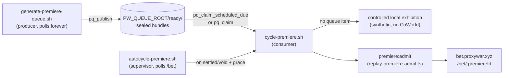

# ProxyWar Premiere Runbook

A "premiere" is a sealed, embargoed replay of a real (or exhibition) ProxyWar
match, admitted into a private catalog and revealed publicly on a schedule
instead of the instant it finishes — so a spoiler can never leak before the
reveal, and (when wagering is enabled) a prediction market can trade against
genuine uncertainty about the outcome. This doc is the operational map: how
to run a cycle, how to tell a starved queue from a broken one, what the two
candidate lanes mean, and where a leaked outcome would actually get caught.

There are **two independent operational paths** onto the same premiere
runtime (admission, leak audit, lifecycle state machine, reveal, retention,
wagering). Do not conflate them:

- **System A — demo/bet queue pipeline.** `generate-premiere-queue.sh`
  (producer) → `premiere-queue-lib.sh` (shared queue) → `cycle-premiere.sh`
  (consumer, admits onto the public `https://bet.proxywar.xyz` origin) →
  `autocycle-premiere.sh` (supervises `cycle-premiere.sh` forever). This
  system generates its **own** CoWorld episodes on demand and only ever
  targets the `bet.proxywar.xyz` demo origin.
- **System B — the Phase 2 bounded watcher.** `src/scripts/replay-premiere-loop.ts`,
  run once a minute by a `launchd StartInterval=60` job. It never touches
  `PW_QUEUE_ROOT` — it watches the **existing** hosted CoWorld league mirror
  directly, holds the freshest newly-completed round, and drives that
  episode through ingest → admit → activate → track → reveal → release
  itself, restarting the beta deployment via
  `deploy/mac/proxywar-beta-launchd-restart.mjs`.

Both paths ultimately call the same admission entry point
(`runReplayPremiereAdmission()` in `src/scripts/replay-premiere-admit.ts`)
and the same lifecycle state machine, so §3–§6 below apply to either.

## 1. System A: producer / consumer / autocycle



### 1.1 Producer — `generate-premiere-queue.sh`

Keeps `PW_QUEUE_ROOT/ready/` topped up with sealed, ready-to-admit real-league
bundles so `cycle-premiere.sh` can admit near-instantly instead of blocking on
a real ~16-minute CoWorld generation. Reactive, not scheduled: the moment
depth drops below target (a claim), it starts building the next one.

```bash
./generate-premiere-queue.sh          # runs forever, polling
./generate-premiere-queue.sh --once   # single attempt then exit (cron/manual)
```

Pipeline per attempt (`attempt_generate`, `generate-premiere-queue.sh:171-331`):
`npm run premiere-wagering:generate` (`generate-xp-request-episode.ts` — the
real, billed CoWorld experience request; pulls the live active roster fresh
every attempt, no cached snapshot) → `npm run premiere-wagering:seal`
(`seal-episode.ts`; **deletes `decisions.jsonl` post-seal** — this is why the
premiere lane below has no drama/story evidence) → `npm run
premiere-wagering:build-source` (`build-source-bundle.ts`; packages into
`bundle.source.json`, derives `turnIntervalMs` from the episode's own
`turnCount` so playback lands near `PW_QUEUE_TARGET_MATCH_MS`) → `pq_publish`
writes `bundle.source.json` + `meta.json` into `ready/<UTC-timestamp>-<runId>/`.
A failed step is logged with its reason and the loop backs off; it never
wedges or spins tight.

Env vars (`generate-premiere-queue.sh:53-81`), all optional:

| Var | Default | Meaning |
|---|---|---|
| `PW_QUEUE_GENERATE_ENABLED` | `true` | Kill switch. `false` → queue never tops up; every cycle falls back to exhibition. |
| `PW_QUEUE_MAX_PER_HOUR` | `4` | Attempt cap/hour (success **or** failure both count — a failed attempt may still have run a real, billed episode before failing downstream). |
| `PW_QUEUE_MAX_PER_DAY` | `80` | Attempt cap/day. |
| `PW_QUEUE_TARGET_DEPTH` | `1` | Spare sealed bundles to keep in `ready/`. |
| `PW_QUEUE_POLL_SECONDS` | `60` | Idle poll interval once topped up. |
| `PW_QUEUE_FAILURE_BACKOFF_SECONDS` | `180` | Sleep after a failed attempt before retrying. |
| `PW_QUEUE_GENERATE_TIMEOUT_SECONDS` | `1800` | Hard wall on the generate step. |
| `PW_QUEUE_STEP_TIMEOUT_SECONDS` | `300` | Hard wall on seal / build-source steps. |
| `PW_QUEUE_TARGET_MATCH_MS` | `1296000` (21.6 min) | Target playback duration; `turnIntervalMs` is derived from it post-generation, clamped to 20–2000 ms/turn. |
| `PW_QUEUE_COWORLD_ID` | `cow_6651aca3-2beb-49b9-9b6b-2573b4be5a63` (`proxywar-ffa-16p`) | CoWorld package id. |
| `PW_QUEUE_VARIANT_ID` | `sixteen-player-ffa-world` | CoWorld variant. |
| `PW_QUEUE_MAX_DECISION_STEPS` | `300` | Passed to `generate-xp-request-episode.ts`. |
| `PW_QUEUE_MAX_SEATS` | `16` | Package's own seat ceiling — a safety net, not today's live constraint (roster is 14). |
| `PW_BET_QUEUE_DIR` | `~/.proxywar-deploy/premiere-queue` | `PW_QUEUE_ROOT` override (`premiere-queue-lib.sh:25`). |

A durable, append-only cost ledger lives at `PW_QUEUE_ROOT/cost-ledger.jsonl`
(`ledger_append`, `generate-premiere-queue.sh:147-166`) — one row per attempt
(success or failure), used both for the hour/day rate caps and for
reconciling against real platform billing (the API does not surface a dollar
figure).

### 1.2 Shared queue mechanics — `premiere-queue-lib.sh`

Sourced by both the producer and the consumer. `PW_QUEUE_ROOT` (default
`~/.proxywar-deploy/premiere-queue`, override `PW_BET_QUEUE_DIR`) holds
`ready/` and `work/`. Item directory names are `<UTC timestamp>-<runId>` —
lexical sort on that prefix *is* chronological order, so a plain FIFO needs
no separate sequence counter.

- `pq_init` — `mkdir -p` + `chmod 700` on root/ready/work.
- `pq_depth` — count of items in `ready/`.
- `pq_claim <dest>` — atomically `mv`s the oldest ready item to `<dest>`;
  prints its name on success, nothing (return 1) on an empty queue. Two
  racing claimers can never both succeed — the loser just sees "nothing to
  claim."
- `pq_publish <staging-dir> <item-name>` — one atomic rename into `ready/`;
  the producer only calls this once both `bundle.source.json` and
  `meta.json` are fully written, so a partial item never becomes visible.
- `pq_claim_scheduled_due <dest> <lead-minutes>` — claims the specific
  `ready/` item a scheduled `FeaturedMatch` record (state `published`, see
  §2) marks as due within `<lead-minutes>`, by delegating to the read-only
  helper `src/scripts/premiere-autocycle-due.ts`. Falls through to plain
  `pq_claim` whenever nothing is due — including when no schedule exists at
  all, or the store is broken. **This wiring is live**: `cycle-premiere.sh`
  calls it before `pq_claim` (`cycle-premiere.sh:228-237`) — the operator's
  explicit schedule takes precedence over plain FIFO. (`premiere-schedule.ts`'s
  own module doc still describes this as a "design note, not wired this
  turn" — that comment is stale; treat the code above as the source of truth.)

### 1.3 Consumer — `cycle-premiere.sh [lead-minutes]`

```bash
./cycle-premiere.sh        # lead-minutes defaults to 4
./cycle-premiere.sh 6      # trading opens ~6 minutes after this returns
```

Replaces whatever premiere is currently live on `bet.proxywar.xyz`. The state
root is wiped every run (deliberate — a root accumulates unusable admissions
after a few cycles otherwise, see `premiere_not_registered` in root
`RUNBOOK.md` §13.6). **Any in-flight session, position, or bankroll on the
previous premiere is destroyed with it.**

Match source, in priority order (`cycle-premiere.sh:219-266`):

1. `pq_claim_scheduled_due` — an operator-scheduled, published item that is
   due.
2. `pq_claim` — plain FIFO from `ready/`.
3. A freshly generated **local exhibition** (`npm run
   premiere:controlled-exhibition`, no CoWorld, synthetic) — the fallback
   when the queue is empty (generator behind, disabled, or rate-capped). A
   synthetic match is a worse product than real, but no market at all is
   worse than either, so the URL never goes dark.

Which one went live is logged loudly (`MATCH KIND: ...`) and recorded to
`/tmp/pw-bet-last-cycle.json` (`kind`: `real-league` | `exhibition`,
`premiereId`, `queueItem`, `httpCode`, `timestamp`) for
`autocycle-premiere.sh` to surface.

Sequence: check queue → stage admission inputs (nonce, `eligibility.json`,
`definition.json`) → stop the origin and wipe the state root → refresh league
data → restart the origin (needed because admission's leak audit fetches the
**public** origin and requires a 200 from `/league`) → `npm run premiere:admit`
(`replay-premiere-admit.ts`, see §3) → restart the origin again onto the new
premiere (admission never hot-registers; the catalog is rebuilt at boot) →
print the `/bet/<premiereId>` URL.

Notable env vars / constants (`cycle-premiere.sh:39-79`) — **none of these
are `PW_BET_LEAD_MINUTES`; lead time is the positional `$1` argument, not an
env var**:

| Var | Default | Meaning |
|---|---|---|
| `$1` (positional) | `4` | Lead minutes before trading opens. |
| `ORIGIN` | `https://bet.proxywar.xyz` | Hardcoded, not overridable. |
| `ORIGIN_PORT` | `8792` | Hardcoded, not overridable — keep in sync by hand with `AUTOCYCLE_ORIGIN_PORT` (§1.4). |
| `PW_BET_TURN_INTERVAL_MS` | `120` | Exhibition-fallback turn pacing (10,800 turns × 120ms ≈ 21.6 min match). |
| `PW_BET_GUEST_KEY_FILE` | `~/.proxywar-deploy/guest-hmac-key.hex` | Guest-cookie HMAC key — deliberately outside the wiped state root, so returning guests keep identity across cycles. |
| `PROXYWAR_POINTS_LEDGER_ROOT` | `~/.proxywar-deploy/points-ledger` | Durable across cycles. |
| `PW_BET_GITHUB_CLIENT_ID_FILE` / `PW_BET_GITHUB_CLIENT_SECRET_FILE` | `~/.proxywar-deploy/github-oauth-client-id` / `-secret` | GitHub OAuth creds — secret file must be `0600`; the server is handed the **path**, never the value, so `ps eww` can't leak it. |
| `PW_BET_LEAGUE_DATA_URL` | `https://beta.proxywar.xyz/ai-league-runs/league/data.json` | Live standings feed refreshed every cycle. |
| `PROXYWAR_ARTIFACTS_ROOT` | `<repo>/artifacts` | Served-root for the leak audit's `/league` probe. |
| `PW_BET_STAGING_DIR` | `/tmp/pw-bet-staging` | Exhibition/queue-claim staging. |
| `PW_BET_MANIFEST_DIR` | `/tmp/pw-bet-manifests` | Agent manifests staged with a `policyIdentity` the shared docs copies lack. |
| `PW_BET_ADMIT_DIR` | `/private/tmp/pw-bet-admit` | Admission input files (nonce, eligibility, definition). |
| `STATE_ROOT` | `~/.proxywar-bet-live/replay-premiere` | Hardcoded, wiped every cycle — **not** env-overridable. |

Real-league checkpoints come from the queue item's own spawn-aware
computation done at seal time (`PremiereWageringCheckpoints.ts`); exhibition
checkpoints land at 35%/65% of `turnCount`, matching
`checkpointSequencesForTurnCount` in `ReplayPremiereLoopCore.ts` (§1.4).

### 1.4 Supervisor — `autocycle-premiere.sh`

Watches `LOCAL_ORIGIN/bet` (bypasses Cloudflare so a tunnel hiccup can't
masquerade as an empty registry) indefinitely and keeps it showing a
tradeable market.

```bash
./autocycle-premiere.sh
```

Rules that are load-bearing (cycling destroys the live premiere and every
position on it):

1. Only cycles on an explicitly terminal status (`settled`/`void`), never on
   an unrecognized status — a scheduled-but-not-started premiere always
   survives.
2. Never treats a failed request as "nothing running" — emptiness must be
   confirmed repeatedly *and* against the local origin.

Env vars (`autocycle-premiere.sh:34-50`):

| Var | Default | Meaning |
|---|---|---|
| `AUTOCYCLE_ORIGIN_PORT` | `8792` | Must match `cycle-premiere.sh`'s hardcoded `ORIGIN_PORT` — not synced automatically. |
| `AUTOCYCLE_GRACE_SECONDS` | `90` | Wait after settled/void before cycling, so late arrivals can read the settlement card. |
| `AUTOCYCLE_POLL_SECONDS` | `20` | Poll interval. |
| `AUTOCYCLE_LEAD_MIN` | `2` | Passed through to `cycle-premiere.sh`. |
| `AUTOCYCLE_EMPTY_STRIKES` | `3` | Consecutive confirmed-empty (or confirmed-down) polls before cycling from nothing. |
| `AUTOCYCLE_FALLBACK_STREAK_WARN` | `3` | Consecutive exhibition cycles before loudly warning the real-league queue looks stuck. |

**Diagnosing a starved queue**: the log line to watch for is
```
!! <N> consecutive FALLBACK exhibition cycles - real queue looks stuck
   (generator disabled/failing/rate-capped? check
   /tmp/pw-bet-queue-generator.log and $PW_QUEUE_COST_LEDGER)
```
(`autocycle-premiere.sh:116`, fires once `fallback_streak >= AUTOCYCLE_FALLBACK_STREAK_WARN`).
Checklist:
- `pq_depth` (source `premiere-queue-lib.sh`, run `pq_depth` in a shell with
  it sourced) — is `ready/` actually empty?
- Is `generate-premiere-queue.sh` even running? Check its log
  (`/tmp/pw-bet-queue-generator.log` under the standard supervisor setup).
- `PW_QUEUE_GENERATE_ENABLED=false`? That's the kill switch — queue never
  tops up by design.
- Rate-capped? `tail $PW_QUEUE_COST_LEDGER` and compare recent `timestamp`
  density against `PW_QUEUE_MAX_PER_HOUR`/`PW_QUEUE_MAX_PER_DAY`.
- A real generation failure? `grep -i FAILED` in the producer's log — every
  failure logs a `reason` (timeout, `PREMIERE_WAGERING_*_FAILED`, missing
  roster file, unparseable result).
- Disk pressure? `generate-xp-request-episode.ts` refuses to write below its
  free-space reserve; `cycle-premiere.sh`'s own exhibition fallback works
  around this with `PROXYWAR_ALLOW_LOW_DISK_HEAVY_WRITE=1` at a lowered
  15 GiB reserve, but the producer does not — reclaim disk if this is the
  cause.

### 1.5 System B — the Phase 2 bounded watcher (`replay-premiere-loop.ts`)

```bash
npm run premiere:loop            # one live iteration
npm run premiere:loop -- --shadow  # read-only observation, no mutation
```

Run by a `launchd StartInterval=60` job — **one iteration per invocation**,
not a long-lived process. Detects a newly completed rated CoWorld league
round, holds its freshest episode from the public league page, ingests and
admits it **in-process** into a sealed premiere, activates it via a
controlled restart of the beta deployment
(`deploy/mac/proxywar-beta-launchd-restart.mjs`), tracks it to reveal, then
releases the hold so the episode publishes ordinarily through the league
mirror. Read-only toward Softmax (CoWorld `rounds`/`replays`/`divisions`
reads + public S3 replay downloads); the only local mutations are the
suppression contract (§6), the retention pin (§6), the private premiere
catalog (via the same `runReplayPremiereAdmission()` System A uses), and the
reviewed launchd restart helper.

`--shadow` runs INGEST only — no contract write, no pin, no admit, no
restart; safe for live observation/debugging.

**Hard invariant: ONLY-LATEST** — never more than one hold active at a time.
A single-instance lock (`withSingleInstanceLock`, atomic `mkdir`, stale
reclaim by owner-PID liveness) means a skipped tick under a long-running
predecessor is expected, not a failure.

Key constants (`src/server/replay-premiere/ReplayPremiereLoopCore.ts`):

| Constant | Value | Meaning |
|---|---|---|
| `PREMIERE_LOOP_SCHEDULE_LEAD_MS` | 5 min | Lead from "now" to the scheduled reveal window (ceil-to-minute). |
| `PREMIERE_LOOP_HOLD_WINDOW_MS` | 75 min | Playback duration + margin; a held episode auto-publishes at `scheduledAt + this` even if never revealed. |
| `PREMIERE_LOOP_POST_REVEAL_COOLDOWN_MS` | 35 min | Keeps a just-revealed premiere resident through reclamation grace; rounds completed in this window are explicitly skipped, not premiered. |
| `PREMIERE_LOOP_SEAL_WINDOW_MS` | 35 min | Cold-start / gap-recovery freshness floor for a completed round to still be worth sealing. |
| `PREMIERE_LOOP_TURN_STARTUP_BUDGET` | 60,000 turns | Admission projection input cap — longer episodes are skipped. |
| `PREMIERE_LOOP_ADMISSION_PROJECTION_TIMEOUT_MS` | 90 s | Hard wall-clock ceiling on the GameRunner checkpoint projection at admission. |
| `PREMIERE_LOOP_MAX_REPLAY_DOWNLOADS` | 3 | Raw replays downloaded while selecting a claim. |
| `PREMIERE_LOOP_MAX_PIPELINE_ATTEMPTS` | 2 | Full pipeline attempts (claim→activate) per round. |
| `PREMIERE_LOOP_MAX_RAW_REPLAY_CACHE` | 3 | Raw replays kept in the bounded fetch cache. |
| `PREMIERE_LOOP_MAX_ACTIVATION_ATTEMPTS` | 3 | Controlled-restart activation attempts across ticks. |
| `PREMIERE_LOOP_ACTIVATION_VERIFY_MS` | 120 s | Bounded post-activation registration verification window (~2 ticks). |
| `PREMIERE_LOOP_MAX_REACTIVATION_ATTEMPTS` | 1 | Exactly one fresh re-activation after a failed verification. |
| `PREMIERE_LOOP_ACTIVATION_BACKOFF_MS` | 120 s | Minimum spacing between activation attempts after a helper refusal. |

`playbackRateForTurnCount(turnCount)`: 1× up to 36,000 turns, 2× beyond.
`checkpointSequencesForTurnCount(turnCount)`: `[round(0.35·turnCount),
round(0.65·turnCount)]`. `PREMIERE_REAL_TURN_INTERVAL_MS = 100`
(`ReplayPremiereContracts.ts:192`) — real-speed OpenFront pacing, the default
for `turnIntervalMs` at rate 1.

Config resolution env vars (`resolveLoopConfig`,
`src/scripts/replay-premiere-loop.ts:135-201`):

| Var | Default | Meaning |
|---|---|---|
| `PROXYWAR_PREMIERE_LOOP_LOOPBACK_URL` | derived from `loadProxyWarDemoServerNetworkConfig` | Loopback base URL for the tracker's own manifest verification. |
| `PROXYWAR_ARTIFACTS_ROOT` | `<cwd>/artifacts` | Same resolution as the demo server / `premiere-candidates.ts`. |
| `PROXYWAR_LEAGUE_ID` | `league_cb60d526-ecfd-4836-ab3a-81fc6cf7dc42` | League watched. |
| `PROXYWAR_LEAGUE_DIVISION_ID` | `div_b54268ee-6b2f-4156-9c2a-8542645e31bc` | Division watched. |
| `PROXYWAR_LEAGUE_RETENTION_PINS` | `<cwd>/deploy/coworld-league-retention-pins.json` | Retention pin manifest path — **must point outside a byte-frozen release checkout in production**, or pin writes dirty the tree. |
| `PROXYWAR_LEAGUE_MIN_FREE_GIB` | `10` | Storage floor (`minimumFreeBytes`). |
| `PROXYWAR_PREMIERE_LOOP_TURN_INTERVAL_MS` | `100` (`PREMIERE_REAL_TURN_INTERVAL_MS`) | Operator override only; default is real-speed pacing. |
| `PROXYWAR_PREMIERE_LOOP_COWORLD_TIMEOUT_MS` | `120000` | CoWorld read-CLI timeout. |

## 2. Two-lane candidate selection

Two independent, read-only ranking CLIs feed the **same** `FeaturedMatch`
store (`featured-matches.json`) but from disjoint sources and with disjoint
evidence. Neither CLI writes the store.

| | PREMIERE lane | ARCHIVE lane |
|---|---|---|
| Script | `src/scripts/premiere-candidates.ts` (`npm run premiere:candidates`) | `src/scripts/feature-candidates.ts` (`npm run feature:candidates`) |
| Source | Sealed, unpublished items in `PW_QUEUE_ROOT/ready/` | Completed, **published** episodes in the live CoWorld league mirror's `data.json` |
| Reads | `meta.json` only — never `bundle.source.json` (too large, and none of its fields matter for ranking) | `CoworldLeagueEpisodeRow[]`, plus `drama-report.json`/`match-story.json` when present on disk |
| Evidence available | `turnCount`, `seatCount`, `replayComplete` (always `true` — an item only reaches `ready/` once fully sealed) | `turnCount`, `decisionCount`, `degradedCount`, `dramaScore`/`dramaGrade`, `entertainmentScore`/`storyGrade` |
| Evidence **unavailable** | `dramaScore`/`entertainmentScore`/`decisionCount`/`degradedCount` — `generate-premiere-queue.sh` deletes `decisions.jsonl` the moment a bundle seals, and `bundle.source.json` never carried them | Drama/story fields are `null` for **every** hosted candidate today: `buildAgentDramaReport`/`buildAgentMatchStory` are only ever invoked by the *local* match pipeline (`ai-agent-league-smoke.ts` etc.), which never publishes into the hosted league this CLI reads. This CLI still checks per-candidate file existence, so it self-heals for free if that ever changes. |
| Severely-degraded floor | `turnCount < 50` (`SEVERELY_DEGRADED_MIN_TURN_COUNT`) or `seatCount < 2` (`SEVERELY_DEGRADED_MIN_SEAT_COUNT`) | `degradedCount / decisionCount ≥ 15%` (`SEVERE_DEGRADED_PERCENT`, matches `CoworldLeagueSiteWriter`'s own warning threshold) or `!replayComplete` |
| Ranking (`rankCandidates` / `compareCandidates`) | severely-degraded last, then `turnCount` desc, then `seatCount` desc, then `queueItemName` asc | severely-degraded last, then composite(drama, story) desc (mean of the non-null scores; `null` sorts last), then `decisionCount` desc, then `turnCount` desc, then `episodeRequestId` asc |
| Writes draft with | `lane: "premiere"`, `state: "candidate"` | `lane: "archive"`, `state: "candidate"` |

```bash
npm run premiere:candidates              # table
npm run premiere:candidates -- --json    # full ranked JSON + rejections
npm run feature:candidates
npm run feature:candidates -- --json
```

### 2.1 Scheduling CLIs (operate on `featured-matches.json`)

All four accept `--queue-root=<dir> --artifacts-root=<dir> --state-root=<dir> --json`
overrides; `<id>` resolves against `matchId`, `queueItemName`, or
`episodeRequestId`.

| CLI | npm script | Effect |
|---|---|---|
| `src/scripts/premiere-schedule.ts` | `premiere:schedule --episode=<id> --at=<ISO-8601>` | `candidate`/`scheduled` → `scheduled`, sets `scheduledAt`. Premiere-lane only. Refuses to resurrect a `cancelled` record. Re-validates the **whole** resulting schedule before writing. |
| `src/scripts/premiere-publish.ts` | `premiere:publish --episode=<id>` | `scheduled` → `published` — the explicit "yes, run this one" signal that `pq_claim_scheduled_due` (§1.2) actually keys off. Also best-effort syncs a `FeaturedMatch`-owned retention pin (§6). |
| `src/scripts/premiere-cancel.ts` | `premiere:cancel --episode=<id>` | `scheduled`/`published` → `cancelled` (terminal, not deleted — stays as an audit trail). Frees the `scheduledAt` slot and removes this record's own retention-pin ownership. |
| `src/scripts/premiere-validate.ts` | `premiere:validate` | Reports every scheduling problem (past-dated slots, collisions, a scheduled record whose source queue item vanished from `ready/`). Non-zero exit on any issue — safe in cron/CI ahead of `premiere:publish`. **Run this after any manual edit to `featured-matches.json`.** |

## 3. Admission

`src/scripts/replay-premiere-admit.ts` (`npm run premiere:admit`) — admits a
staged real-league or exhibition bundle into sealed premiere state.
`runReplayPremiereAdmission()` is the in-process entry point both System A
(`cycle-premiere.sh`) and System B (`replay-premiere-loop.ts`) call.

- `REPLAY_PREMIERE_ADMISSION_PROJECTION_TIMEOUT_MS = 90_000` — same 90 s
  budget as `PREMIERE_LOOP_ADMISSION_PROJECTION_TIMEOUT_MS` (§1.5): the
  checkpoint projection must build and durably publish before catalog
  visibility, or the admission fails.
- `MAX_PRESENTATION_SPAN_MS = 45_000` per chunk build.
- Byte ceilings: source bundle ≤ 256 MiB, result ≤ 2 MiB, each input JSON
  file ≤ 1 MiB, ≤ 16 served roots.
- Validates the eligibility/embargo evidence (§3.1) **before** building the
  checkpoint projection, so a slow prelude can't consume the timeout budget
  and then run an unfenced projection.
- Related, standalone CLIs: `premiere:prepare-projection`
  (`replay-premiere-prepare-projection.ts`, builds the checkpoint projection
  independently for test/debug) and `premiere:ingest-coworld`
  (`replay-premiere-ingest-coworld.ts`, read-only CoWorld round/replay/division
  metadata reads, shadow-mode support).

### 3.1 Embargo / leak-audit gate (pre-admission)

`src/server/replay-premiere/ReplayPremiereLeakAuditCollector.ts` —
`collectReplayPremiereLeakAudit()` fetches every manifest target (public URLs
the outcome could already be visible on — e.g. the deployment's own `/league`
page) under time/body-size caps, inspects response headers
(`Content-Length`, `Content-Encoding`), decodes bodies as UTF-8, and hashes
every piece of evidence into a `VerifiedReplayPremiereLeakAuditReceipt`
(`schemaVersion`, `manifest`, `evidence[]`, `transfers[]`, `checkedAt`,
`manifestHash`/`evidenceHash`/`transferEvidenceHash`).

Limits (`ReplayPremiereLeakAuditCollectorLimits`): `maxTargets`,
`maxTargetUrlBytes`, `maxBodyBytesPerTarget`, `maxTotalBodyBytes`,
`maxHeaderBytesPerTarget`, `maxHeaderCountPerTarget`, `requestTimeoutMs`,
`totalTimeoutMs`.

Pass/fail (`collectReplayPremiereLeakAudit`,
`ReplayPremiereLeakAuditCollector.ts:224-296`): the manifest itself is
preflighted first (`assessPremiereLeakAudit` with no evidence — catches a
malformed manifest, an invalid target, or a missing required surface before
any network call). Then every target is actually fetched; a per-target body
that would exceed `maxTotalBodyBytes` aborts the whole audit
(`collector_total_body_ceiling_exceeded`), as does exceeding
`totalTimeoutMs`. Finally the **collected** evidence is assessed again — the
audit only issues a receipt when `assessment.status === "passed"`; anything
else throws `collected_leak_audit_failed` and admission is refused. The
receipt itself is an unforgeable class instance (`issuedLeakAuditReceipts`
`WeakSet`) — `VerifiedReplayPremiereLeakAuditReceipt.isAuthentic()` and
`.verifyForEligibility()` re-hash and re-bind the receipt against the stored
eligibility record before it's trusted anywhere downstream, so a receipt
can't be replayed against a different manifest or evidence set.

## 4. Lifecycle state machine

`src/server/replay-premiere/ReplayPremiereStateMachine.ts`. States
(`PremiereState`, `ReplayPremiereContracts.ts:12-20`): `draft`, `scheduled`,
`playing`, `checkpoint`, `revealed`, `failed`, `cancelled`, `archived`.
Terminal: `revealed`, `failed`, `cancelled`, `archived`.

> This is a **different** state machine from the `FeaturedMatch` scheduling
> states in §2 (`candidate`/`scheduled`/`published`/`revealed`/`archived`/`cancelled`).
> The names overlap but the scopes don't: `FeaturedMatch` state tracks an
> operator's *plan*; `PremiereState` tracks the *live runtime* once admitted.

`allowedTransitions` (`ReplayPremiereStateMachine.ts:106-124`):

| From | Action | To | Actor | Guard |
|---|---|---|---|---|
| `draft` | `publish` | `scheduled` | operator | `VerifiedPremiereEligibilityGate` |
| `draft` | `cancel` | `cancelled` | operator | reason `cancelled_by_operator` \| `source_ineligible` |
| `scheduled` | `start` | `playing` | service | `serviceReady: true` |
| `scheduled` | `cancel` | `cancelled` | operator | reason as above |
| `playing` | `open_checkpoint` | `checkpoint` | service | — |
| `playing` | `reveal` | `revealed` | service | `VerifiedPremiereRevealGate` (terminal-chunk chain) |
| `playing` | `fail` | `failed` | operator or service | reason `integrity_failure` \| `outage_exceeded` \| `runtime_failure` |
| `checkpoint` | `resume` | `playing` | service | — |
| `checkpoint` | `fail` | `failed` | operator or service | reason as above |
| `revealed` \| `failed` \| `cancelled` | `archive` | `archived` | operator or service | — |

Every transition emits a `PremiereTransitionAuditEvent` (action, `fromState`,
`toState`, actor, `occurredAt`, `lifecycleVersion`,
`eligibilityRecordHash`/`publicationCommitmentHash`, source ids, terminal
reason code, `lastSafeReleasedSequence`).

## 5. Reveal

`src/server/replay-premiere/ReplayPremiereRevealCommit.ts`. The atomic
`playing → revealed` transition is `ReplayPremiereAtomicPublication.commitReveal()`
(an instance method on the class that owns the validated pre-reveal view —
not a bare function). It:

1. Refuses if a commit is already in flight, the locked lifecycle snapshot
   passed in is stale, a reveal was already published, or the terminal chunk
   doesn't verify against this premiere's own gate — throws
   `stale_or_fabricated_reveal_lifecycle` / `reveal_commit_in_flight`.
2. Verifies a `VerifiedPremiereRevealGate` (locked lifecycle + publication
   gate + the terminal chunk + the last published chunk).
3. Calls `transitionPremiereLifecycle(current, { action: "reveal", actor:
   "service", occurredAt: terminal.revealedAt, gate })` — the state-machine
   transition from §4.
4. Builds the `PremiereRevealResponse` (outcome, seeds, checkpoint id,
   signature) and the `PremiereRevealPointerResponse` (indirect manifest
   link).
5. **Durably appends to the event store before updating the in-memory
   lifecycle snapshot** — `persistence.appendAndSnapshot(...)` happens, and
   only after that succeeds does `this.published` get reassigned. Crash
   between those two steps recovers cleanly on the durable event, never on a
   half-updated in-memory view.
6. Idempotency is double-enforced: the `idempotencyKey: reveal:${publicationCommitmentHash}`
   passed to the event store, **and** the state machine itself (there is no
   `revealed → revealed` transition in the table above) both prevent a
   re-reveal.

## 6. Retention pins + suppression

### 6.1 Retention pins

`deploy/coworld-league-retention-pins.json` (override
`PROXYWAR_LEAGUE_RETENTION_PINS`) — a durable manifest of
`episodeRequestId → publicRunKey` (`league-coworld-*` pattern) + a human
`reason` string (e.g. `modular-council-incident`, `rci-cycle-01-causal-evidence`
in the current file). Consumed by `pruneCoworldLeagueMirrorArtifacts`
(`coworld-league-prune.ts`) to keep a pinned episode's **public** artifacts —
the rendered run bundle and cached `.replay` — out of LRU cleanup. It never
protects the private sealed premiere source (a separate mechanism,
`<replayPremierePrivateStateRoot>/reclaim-exclude.txt`, handles that).

`src/server/agents/CoworldLeagueArtifactRetention.ts` is the **only** correct
way to mutate the manifest: `addRetentionPinOwner` /
`removeRetentionPinOwner` (thin wrappers over `applyRetentionPinOwnerBatch`,
locked via `withFileMutex`). The schema allows exactly **one** pin entry per
`episodeRequestId`, so multi-owner protection lives inside that entry's
`reason` field as a `;`-joined, exact-match set of owner tags. **Two
independent writers share the same manifest** — the loop's own premiere-hold
claim (`replay-premiere-loop.ts`'s `pinHoldArtifacts`/`unpinHoldArtifacts`,
tag `premiere-hold:<premiereId>`, alive only for the hold's own duration) and
a `FeaturedMatch`'s claim (`FeaturedMatchRetentionPin.ts`, alive as long as
the operator keeps a record featured). An artifact stays protected as long
as **any** tag remains on the entry; a caller applying several operations at
once (e.g. a reconcile pass) must use `applyRetentionPinOwnerBatch`, not call
the single-op functions concurrently — that reopens the exact lost-update
race the lock exists to close. (An earlier version of this file had each
owner run its own bespoke read-modify-write and produced two real,
opposite-direction bugs — see the module's own doc comment for the incident
history; don't reintroduce a third writer.)

### 6.2 Suppression contract

`src/server/agents/CoworldLeaguePremiereSuppression.ts` — the shared,
fail-**open** contract between the read-only league mirror
(`coworld-league-mirror.ts`, default poll/publish cadence `intervalSeconds: 300`)
and the premiere loop. The loop atomically writes the contract to declare
which just-finished episodes it has claimed; the mirror reads it and
suppresses those episodes so the league page never spoils a premiere before
reveal. Since 2026-07-22 ("every round is premiere") the loop heartbeats a
**standing** contract every live tick even with zero holds — the blanket
`quarantineMs` defers every freshly-completed episode until the loop decides
whether to premiere it (an accepted ~12-minute battle-card lag). The contract
lives outside the state root, so it survives cycle restarts.

Constants: `PREMIERE_SUPPRESSION_STALE_MS = 15 min` (a contract older than
this is treated as stale/fail-open — bounds how long a crashed loop can keep
suppressing), `PREMIERE_SUPPRESSION_MAX_CLOCK_SKEW_MS = 2 min`,
`PREMIERE_SUPPRESSION_DEFAULT_QUARANTINE_MS = 12 min`. Availability
invariant: every non-usable contract state (missing, corrupt, unknown
schema, stale, future-dated) resolves to `{status: "stale", reason}`, and
**every** predicate returns the non-suppressing answer for a stale state —
suppression is a best-effort spoiler shield layered on an
availability-first mirror, never a new way to freeze or hide the league.

## 7. Wagering coupling (interface only)

The prediction-market surface hangs off the **same** premiere lifecycle
documented in §4–§5, but lives in its own read-only-to-this-doc subsystem:
`src/server/replay-premiere/wagering/**`.

- `ReplayPremiereMarket.ts` — stateless LMSR market mechanics
  (`status: "open" | "settled"` — there is **no** separate `checkpoint`/`void`
  status; a void market is `status: "settled"` with `winnerSeatId: null`).
  `settleMarket({ winnerSeatId })`: winning shares pay a fixed
  `SHARE_PAYOUT = 100` credits/share, losing shares are worthless, a void
  settlement (`winnerSeatId === null`) refunds cost basis. Liquidity
  `b = max(20, round(5 × outcomeCount))` (`liquidityForOutcomeCount`).
- `ReplayPremiereMarketRules.ts` — `STARTING_BANKROLL = 1000`,
  `MIN_STAKE = 10`. Max stake is **not** a fixed constant — `maxStake(bankroll)
  = floor(bankroll / 2)`, a dynamic 50%-of-bankroll cap enforced by
  `validateBuyStake`. Sells are never stake-limited (they return money;
  only holdings matter).
- `ReplayPremiereInteractions.ts` — the coupling point: `mutate(transaction)`
  ties market trades, admission, checkpoint advances, and settlement to the
  same premiere lifecycle snapshot. Order admission additionally requires
  the premiere's own runtime state to be `"playing"` or `"checkpoint"`
  (`market_not_live` otherwise) — a second, independent gate on top of
  `market.status`.

This runbook documents premiere **operations**, which run identically
whether or not wagering is enabled. The security/gating boundary — the
subsystem is off by default in the public/league-showcase deployment via
`PROXYWAR_WAGERING_ENABLED` (absent by default) — is covered in
`docs/PROXYWAR_BETA_RELEASE_CHECKLIST.md`; this doc does not restate it.

## Known gaps

- **`premiere-schedule.ts`'s own module doc comment is stale.** It describes
  the "autocycle coexistence" wiring (`pq_claim_scheduled_due`) as a "design
  note, not wired this turn," but `premiere-queue-lib.sh` and
  `cycle-premiere.sh` both show it fully wired and live today (§1.2, §1.3).
  Nobody has gone back to update that comment.
- **`AUTOCYCLE_ORIGIN_PORT` and `cycle-premiere.sh`'s `ORIGIN_PORT` are two
  separate hardcoded/`8792` values with no shared source of truth** — if the
  bet-origin port ever changes, both scripts need a manual edit.
- **Drama/story evidence is unavailable for both candidate lanes today**,
  for structurally different reasons (premiere lane: `decisions.jsonl`
  deleted at seal time; archive lane: the hosted-episode pipeline never
  invokes the drama/story report builders in the first place). Neither
  ranking uses it; both note the absence honestly in `evidence.notes`
  instead of fabricating a score.
- **`premiere_not_registered` after a state-root reset is a known,
  unresolved flake** (root `RUNBOOK.md` §13.6) — `cycle-premiere.sh`'s
  comments reference it directly, but root cause was never investigated.
  Current workaround is re-admitting with a fresh premiere id and confirming
  via `curl` before opening a browser.
